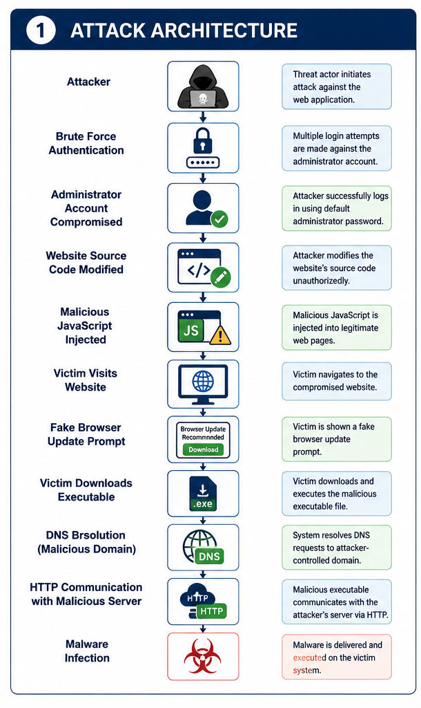
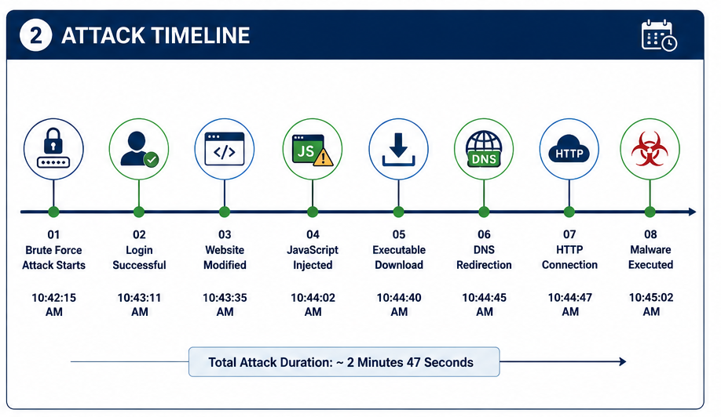
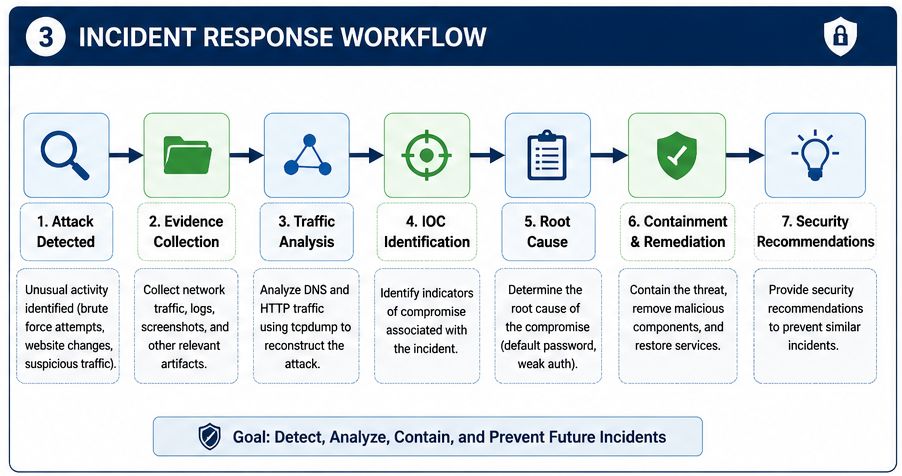

# Web Server Compromise Investigation

## Project Overview

This project documents the investigation of a compromised web server following a brute-force attack against an administrative account.

The attacker successfully authenticated using a default administrator password, modified the website's source code, injected malicious JavaScript, and redirected users to a malicious website through an executable download.

The investigation focused on reconstructing the attack sequence, analyzing DNS and HTTP network traffic, identifying the root cause, and recommending security controls to prevent similar incidents.

---

## Investigation Summary

| Attribute | Details |
|----------|---------|
| Incident Type | Web Server Compromise |
| Attack Vector | Brute Force Authentication |
| Initial Access | Default Administrator Credentials |
| Affected Component | Website Administration Panel |
| Malware Delivery | Malicious JavaScript Injection |
| Network Protocols | DNS, HTTP |
| Investigation Focus | Root Cause Analysis & Network Traffic Analysis |
| Status | Investigation Completed |

---

## Objectives

- Investigate a web server compromise.
- Analyze DNS and HTTP network traffic.
- Identify indicators of compromise (IOCs).
- Determine the root cause of the incident.
- Recommend security improvements.
- Document the complete incident response process.

---

## Technologies Used

- tcpdump
- DNS
- HTTP
- Network Traffic Analysis
- Incident Response
- Root Cause Analysis
- Malware Analysis
- MITRE ATT&CK Framework

---

## Incident Scenario

A public-facing web application was compromised after an attacker successfully performed a brute-force attack against the administrator account.

The attacker authenticated using a default administrator password and obtained full administrative access to the website.

After gaining access, the attacker modified the website's source code by injecting malicious JavaScript that displayed a fake browser update prompt. Visitors who downloaded and executed the file were redirected to an attacker-controlled domain, potentially exposing their systems to malware infection.

The legitimate website administrator was subsequently locked out after the attacker changed the administrative password.

---

## Attack Architecture

The following diagram illustrates the complete attack chain from the initial brute-force attack to the final malware infection.



---

## Attack Timeline

The investigation reconstructed the complete sequence of events observed during the compromise.



---

## Incident Response Workflow

The following workflow summarizes the investigation process followed during the incident response.




---

## Attack Flow

The attack followed the sequence below:

1. Brute-force attack against the administrator account.
2. Successful authentication using a default password.
3. Unauthorized modification of the website source code.
4. Malicious JavaScript injection.
5. Fake software update presented to visitors.
6. Execution of a malicious executable file.
7. DNS resolution to an attacker-controlled domain.
8. HTTP communication with the malicious server.
9. Potential malware infection of victim systems.

---

## Network Analysis

Network traffic analysis was performed using **tcpdump** to reconstruct the attack sequence and identify malicious communications.

The investigation revealed that the attack relied primarily on two network protocols:

### DNS (Domain Name System)

DNS traffic was observed when the victim accessed the legitimate website and again when the browser resolved the attacker-controlled domain following execution of the malicious file.

### HTTP (Hypertext Transfer Protocol)

HTTP was used to deliver the compromised web content, initiate the malicious file download, and establish communication with the attacker-controlled server after the redirection process.

The combination of DNS resolution and HTTP communication allowed the complete attack chain to be reconstructed.

---

## Indicators of Compromise (IOCs)

The investigation identified the following indicators associated with the incident:

| Indicator | Description |
|-----------|-------------|
| Repeated login attempts | Brute-force attack against administrator account |
| Default administrator password | Initial compromise |
| Modified website source code | Unauthorized changes |
| Malicious JavaScript | Code injection |
| Executable download | Malware delivery |
| DNS requests | Redirection to malicious domain |
| HTTP traffic | Communication with attacker-controlled server |
| Password changed | Administrator lockout |

---

## MITRE ATT&CK Mapping

| Tactic | Technique | ID |
|---------|-----------|------|
| Initial Access | Brute Force | T1110 |
| Persistence | Valid Accounts | T1078 |
| Execution | User Execution | T1204 |
| Command and Control | Application Layer Protocol: Web Protocols | T1071.001 |

---

## Security Recommendations

Based on the investigation, the following security controls are recommended:

- Implement Multi-Factor Authentication (MFA) for administrative accounts.
- Eliminate default passwords.
- Enforce strong password policies.
- Configure account lockout thresholds.
- Implement rate limiting for authentication attempts.
- Monitor authentication logs for brute-force activity.
- Continuously monitor DNS and HTTP traffic for suspicious behavior.

---

## Project Structure

```text
Web-Server-Compromise-Investigation/
│
├── README.md
├── LICENSE
├── .gitignore
│
├── documentation/
│   └── Web_Server_Compromise_Investigation.pdf
│
├── images/
│   ├── attack_architecture.png
│   ├── attack_timeline.png
│   └── incident_response_workflow.png
│
└── indicators/
    └── iocs.md
```

---

## Documentation

A complete technical incident report is available below.

📄 **[View Full Incident Report](documentation/Web_Server_Compromise_Investigation.pdf)**

The report contains:

- Incident Overview
- Investigation Process
- Network Protocol Analysis
- Indicators of Compromise
- Root Cause Analysis
- Security Remediation
- Security Impact
- Skills Demonstrated

---

## Skills Demonstrated

| Category | Skills |
|----------|--------|
| Incident Response | Incident Investigation |
| Network Analysis | DNS & HTTP Traffic Analysis |
| Traffic Analysis | tcpdump |
| Threat Analysis | Malware Delivery Chain |
| Authentication Security | Brute Force Analysis |
| Root Cause Analysis | Security Assessment |
| Documentation | Technical Incident Reporting |
| Security Frameworks | MITRE ATT&CK |

---

## Key Takeaways

- Demonstrated a structured incident response methodology.
- Identified indicators of compromise through network traffic analysis.
- Investigated the complete attack lifecycle from initial access to malware delivery.
- Applied root cause analysis to identify security weaknesses.
- Proposed practical security recommendations to reduce future risk.

---


## Conclusion

This investigation demonstrates how weak authentication controls and default administrative credentials can lead to a complete web server compromise.

By analyzing DNS and HTTP network traffic, reconstructing the attack sequence, identifying indicators of compromise, and determining the root cause, the incident response process provides a structured understanding of how the attack was executed and how similar compromises can be prevented in the future.

---

## Future Improvements

- Include Wireshark packet analysis.
- Perform malware hash analysis using VirusTotal.
- Add IOC extraction scripts.
- Create Sigma detection rules.
- Develop SIEM detection queries.
- Map additional MITRE ATT&CK techniques.
- Automate IOC extraction using Python.
---

## Author

**Roberto Almaguer**

Software Engineer | Aspiring SOC Analyst

This project is part of my Cybersecurity Portfolio and demonstrates practical incident response, network traffic analysis, and security investigation techniques.